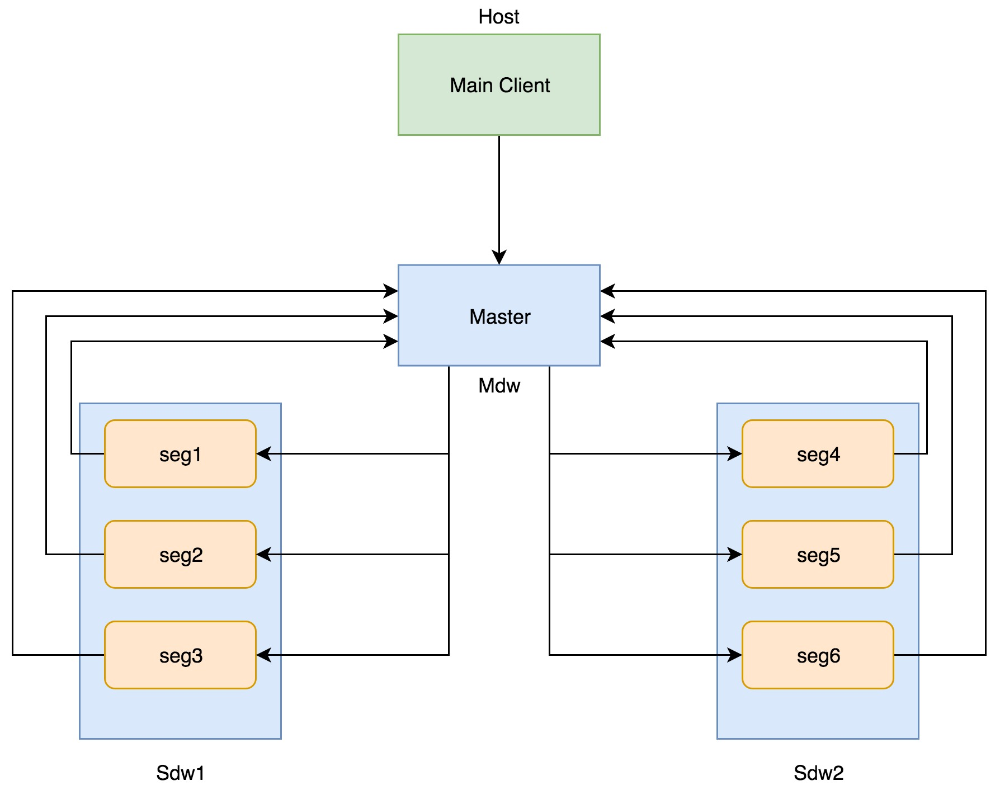
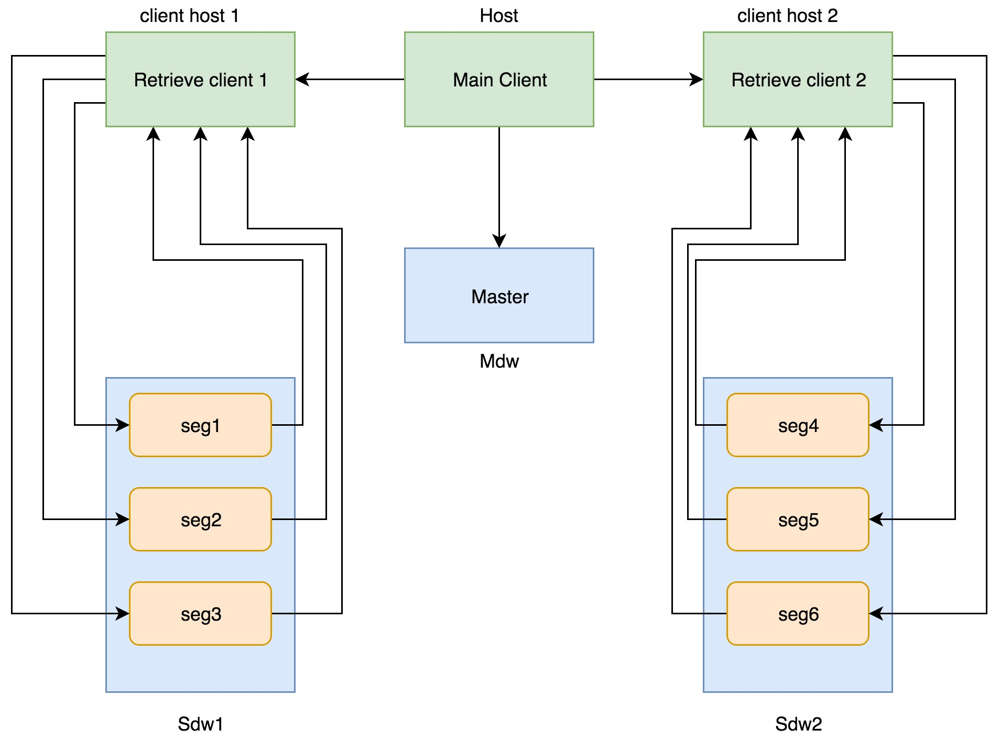

# GP2GP Client 
A mutiple-client GPDB query runner using parallel cursor among GPDB cluster. 

Information about parallel cursor: https://github.com/greenplum-db/gpdb/wiki/GPDB-Parallel-Cursor

If you want single-client query runner, see branch 1.X

## Overview

The program provides 2 ways to execute a query from a GPDB cluster

1. Normal Cursor: 

<div align=center>

</div>

2. Parallel Cursor: 

<div align=center>

</div>

## Environment

- Python version: 2.7

- GPDB version: commit ab0787718f17e4c54110fe507625ede4efebfb84 at https://github.com/liming01/gpdb/commits/feature_parallelcursor


## Before running

- Install dependency on main client

```bash
$ ./env.sh
```

- Setup clients config file(default name: clients.conf)
```
10.1.1.1
10.1.1.2
10.1.1.3
```

- Add the id_rsa.pub content of the main client to the authorized_keys of both root and gpadmin @ master, every segments, and every client host

- Add the gpadmin's id_rsa.pub on each client host to the authorized_keys of gpadmin@ every segment machine. (can be done with gpssh-exkeys tool)

- Deploy the retrieve clients to client hosts

Run the gp2gp_client.py with -D, -H, -p, -u, -P, -c  options

Example:
```bash
$ python gp2gp_client.py -D -H localhost -p 15432 -u gpadmin -c client.conf
```

---

## gp2gp_client.py
#### Runs a single query once, using either normal cursor or parallel cursor
```
Usage: gp2gp_client [options]

GP2GP Client Demo

Options:
  -h, --help            show this help message and exit
  -d DATABASE, --database=DATABASE
                        Connect to the database
  -H HOST, --host=HOST  Connect to the host, DEFAULT VALUE Env 'PGHOST'
  -p PORT, --port=PORT  Connect to the database on which port, DEFAULT VALUE
                        Env 'PGPORT'
  -u USER, --user=USER  username to connect the db
  -P PASSWORD, --password=PASSWORD
                        password to connect the db
  -q QUERY, --query=QUERY
                        the query which is sent to server
  -f FILENAME, --file=FILENAME
                        the file that stores the query
  -n, --normal          use normal cursor instead of parallel cursor
  -D, --deploy          deploy the clients by uploading and running the scripts
  -c CLIENT_CONF, --client_conf=CLIENT_CONF
                        the config file that stores the client machines,
                        DEFAULT VALUE 'clients.conf'
  -l LOG_LEVEL, --level=LOG_LEVEL
                        log level: info|debug, DEFAULT VALUE 'info'
```

## gp2gp_perf_test.py
#### Iterate through 22 TPC-H queries. For each query, run it in both type of cursor. Record the execution time and output to result.csv.

```
Usage: gp2gp_perf_test.py [options]

GP2GP Performance Test Client

Options:
  -h, --help            show this help message and exit
  -d DATABASE, --database=DATABASE
                        Connect to the database
  -H HOST, --host=HOST  Connect to the host, DEFAULT VALUE Env 'PGHOST'
  -p PORT, --port=PORT  Connect to the database on which port, DEFAULT VALUE
                        Env 'PGPORT'
  -u USER, --user=USER  username to connect the db
  -P PASSWORD, --password=PASSWORD
                        password to connect the db
  -c CLIENT_CONF, --client_conf=CLIENT_CONF
                        the config file that stores the client machines
  -l LOG_LEVEL, --level=LOG_LEVEL
                        log level: info|debug
```
